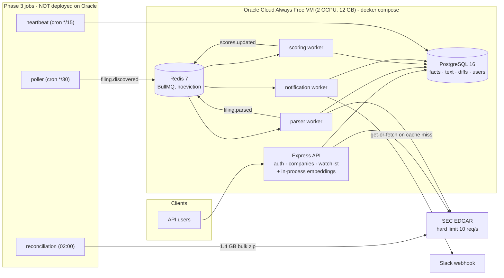

# ARCHITECTURE — EDGAR Radar

How the system is built today, what actually limits it, and what changes at
roughly **100**, **10,000** and **1,000,000** users. Phase 7, step 1.

Every stage below names specific components and the reason each one is
introduced — not "add more servers". Numbers are labelled:

- **measured** — observed on this project's real systems (dev database, the
  Oracle production VM, the Azure Phase 3 VM), with the source noted;
- **assumed** — an input to the arithmetic, stated so it can be challenged;
- **derived** — arithmetic from the two above.

No longer planning document existed to adapt (`docs/` is empty), so this is
written from the code and from measurements taken on 2026-09-16.

---

## 1. The system today

| Component | What it is | Notes |
|---|---|---|
| **API** | One Express process (`src/server.ts`) | Routes: `GET /companies/:cik`, `/:cik/facts`, `/:cik/risk-factor-diff`; `POST /auth/register`, `/auth/login` (bcrypt, JWT); `GET/POST/DELETE /watchlist` (JWT). Bull Board only when `ENABLE_BULL_BOARD=true`. |
| **PostgreSQL 16** | Single container, named volume | EAV `filing_facts` with append-only restatements (`effective_from`), `filing_text_sections` with a generated `tsvector` + GIN index, cached `filing_risk_factor_diffs`. |
| **Redis 7** | Single container, `maxmemory-policy noeviction` | Queue backend only. `noeviction` is required by BullMQ: evicting keys would silently drop jobs. |
| **Queue pipeline** | 3 BullMQ queues, one worker process each | `filing.discovered` → parser (SEC facts refresh + 10-K text) → `filing.parsed` → scoring (3 ratio scores, DB reads only) → `scores.updated` → notification (Slack if anyone watches the company). Each stage is idempotent via `stage_completions (accession_number, stage)`. |
| **Phase 3 jobs** | poller, heartbeat, reconciliation | **Not running in production** — they resolve `data/company-universe.json` via `__dirname`, which breaks once compiled, so they were left out of Compose. Production therefore never discovers new filings on its own (measured: 0 `poller_runs` rows on Oracle). They run only on the separate Azure VM used for Phase 3's 48h test. |
| **SEC client** | `src/sec.ts` | Token bucket at 7 req/s with a burst of 7, plus retry with exponential backoff and jitter on network errors and 5xx. |
| **Embeddings** | `Xenova/all-MiniLM-L6-v2` (quantized ONNX, 384 dims) | Runs **inside the API process**; weights baked into the image at build time. |
| **Hosting** | Oracle Always Free ARM VM, `docker compose` | Every long-running container `restart: unless-stopped`. Deploy-on-merge from GitHub Actions after lint, unit, build and integration checks. $0 by constraint. |

### Measured baseline

| Measurement | Value | Source |
|---|---|---|
| Production host | 2 OCPU, 11.9 GB RAM (10.9 GB available), 6.4 of 48 GB disk used | Oracle VM, 2026-09-16 |
| Container memory at idle | API 43 MiB; workers 31–38 MiB each; Postgres 21 MiB; Redis 5 MiB | `docker stats`, Oracle |
| Production data | 8.3 MB database; 2 companies, 70 facts, 0 users | Oracle Postgres |
| Full-universe data | 23 MB database; 197 companies; 6,178 facts (**~31 per company**); 26 10-K text sections averaging **352 KB** (11 MB, the largest table) | local dev Postgres |
| Poll cycle, 196 companies | 47–50 s in steady state; 95 s for a cycle that found 762 backlog filings | Azure VM `poller_runs` |
| Reconciliation | 1.4 GB bulk download; ~30 s per nightly run, ~2 min for a startup run on the memory-constrained 892 MiB VM; peak RSS 480.6 MB after the streaming fix | Azure VM logs; PROGRESS.md |
| Real outage observed | Postgres restarted by an unattended OS upgrade; poller crashed (unhandled pool error) and stayed down 3.5 days | Azure VM, 2026-09-12 (fixed in PR #13) |

---

## 2. What actually drives load

There are **two independent axes**, and most of the interesting design falls
out of keeping them apart.

**The data axis — number of companies tracked.** Ingestion cost scales with
companies and filings, *not* with users. It has a hard external ceiling: SEC
allows 10 requests per second per client, and this project deliberately
uses 7.

- One poll cycle costs one `submissions` request per company. At 7 req/s a
  30-minute cycle has room for about 7 × 1,800 = **12,600** such requests
  (derived) before follow-up fetches (companyfacts, 10-K documents) compete
  for the same budget. SEC's bulk `companyfacts.zip` holds 10,000+ company
  files (measured in Phase 3), so **covering the whole market fits the rate
  limit only if detection and processing share one global budget** — which is
  not true today (see §3).
- Storage grows with companies and time: ~31 fact rows per company in the
  current tag set, and ~352 KB per ingested 10-K text section (measured). At
  10,000 companies with one new 10-K each a year, that is roughly **3.5 GB of
  text per year** (derived) — comfortable for one Postgres, and unrelated to
  user count.

**The user axis — people using the API.** Users add read traffic, logins,
watchlist rows and notification deliveries. They add SEC load only through
two paths: a `get-or-fetch` on a company not yet stored, and the *first*
request for a company's risk-factor diff. Both are cache-miss paths, and both
disappear once ingestion pre-populates the data.

The consequence that shapes every stage: **the write/ingest side is bounded
by SEC and sized by the company universe; the read side is what scales with
users.** Scaling users is a read-path and fan-out problem, not an ingestion
problem.

---

## 3. Bottlenecks that exist today, ranked

These are present in the current code, before any growth. Each later stage
depends on some of them being fixed.

1. **The SEC rate limit is per process, not global.** `TokenBucket` keeps its
   tokens in memory in each process. The API's get-or-fetch path and the
   parser worker can call SEC concurrently at 7 req/s *each* — up to 14 req/s
   against a 10 req/s hard limit — and a deployed poller would add a third
   budget. This is a latent correctness bug now, and it forbids adding worker
   replicas until fixed.
2. **Risk-factor diffs are computed inside the API request.** A cache miss
   downloads two 10-Ks and embeds every chunk in the API process. Embedding is
   CPU-bound on Node's single event loop, so one such request stalls every
   other request on that API instance for its duration.
3. **User requests can trigger SEC calls** (`get-or-fetch`), coupling user
   traffic to the external rate limit.
4. **Notifications don't fan out.** The notification worker posts one Slack
   message per filing listing *every watcher's email address* — it cannot
   deliver to individual users, and it exposes users' emails to the channel.
5. **`watchlists` has no index usable for a lookup by `cik`.** Its indexes are
   `(user_id)` and unique `(user_id, cik)`; `getWatchersForCik` filters on
   `cik` alone, so it becomes a sequential scan as watchlists grow.
6. **Everything is one host with no off-box backup.** Postgres, Redis and all
   services share one VM; the data volume is not backed up anywhere else, on
   an Always Free instance that Oracle may reclaim when idle.
7. **Ingestion isn't running in production** (the Phase 3 jobs are not
   deployed — §1), so production data only grows through user cache misses.
8. **Connection budget.** node-postgres defaults to a pool of 10 connections
   per process; Postgres defaults to `max_connections = 100`. Five processes
   use at most 50 today, but API replicas multiply this quickly.

---

## 4. Stage 1 — about 100 users

**Assumptions:** 100 registered users, 50% active on a given day, ~50
requests each per active day, each watching ~10 companies; the existing
197-company universe.

**Derived load:** 2,500 requests/day ≈ **0.03 req/s** on average, well under
1 req/s at a 10× peak; 1,000 watchlist rows. The measured idle footprint
(under 150 MiB for all containers) leaves the 12 GB host almost entirely free.

**Verdict: the current single VM is more than enough capacity.** This stage
is not about scale; it is about correctness and not losing data. Components
to add or change:

| Change | Specific component | Why |
|---|---|---|
| Make the SEC budget global | Route every SEC call through **one BullMQ queue with a worker `limiter`** (`max: 7, duration: 1000`), which BullMQ enforces in Redis across all workers of that queue — or a **Redis-backed token bucket** shared by all processes | Fixes bottleneck 1; prerequisite for any worker replica later |
| Run ingestion in production | Fix the `__dirname` data path; add **poller, heartbeat and reconciliation as Compose services** with `restart: unless-stopped` and a writable cache volume | Fixes bottleneck 7 |
| Move diffs off the request path | **`risk-diff.requested` queue + embedding worker**; the API returns `202 Accepted` on a miss and the stored diff afterwards | Fixes bottleneck 2 |
| Backups | **Nightly `pg_dump` shipped off the VM** (object storage), with a tested restore | Fixes the data-loss half of bottleneck 6 |
| Index | **`CREATE INDEX ON watchlists (cik)`** | Fixes bottleneck 5 before it matters |
| Alert noise | Heartbeat alerts once per outage plus a recovery message, instead of every throttle window | The Phase 3 run sent 68 alerts for one outage |

---

## 5. Stage 2 — about 10,000 users

**Assumptions:** 10,000 users, 20% daily active, ~50 requests per active day,
~10 watched companies each; peak traffic 10× average; the universe widened
toward the full SEC filer list (on the order of 10,000 companies).

**Derived load:**

- 2,000 active users × 50 = 100,000 requests/day ≈ **1.2 req/s average, ~12
  req/s peak** — still one API process's order of magnitude, *if* no request
  does CPU work or SEC calls inline (Stage 1 fixes).
- 100,000 watchlist rows; a popular company might have ~2,000 watchers
  (assumed ~20% of users), so one filing can produce ~2,000 notifications.
- Ingestion: ~10,000 `submissions` requests per 30-minute cycle — near the
  12,600 ceiling from §2, so polling every company every 30 minutes stops
  fitting alongside follow-up fetches.

**What changes, and the component for each:**

| Pressure | Component | Why this, specifically |
|---|---|---|
| Repeated reads of slow-changing data | **Redis response cache** for `/companies/:cik`, `/:cik/facts` and `/:cik/risk-factor-diff`, keyed by CIK, **invalidated when that CIK's `filing.parsed` job completes** | Facts only change when a filing arrives, so event-driven invalidation gives a high hit rate without stale data. This is Phase 7 step 3. |
| Cache and queue have opposite memory policies | **A second Redis instance for the cache** (`allkeys-lru`), separate from the queue Redis (`noeviction`) | A cache must evict under pressure; BullMQ must never. One instance cannot do both safely. |
| Read load competing with ingestion writes | **Postgres streaming read replica**; read-only endpoints use a second pool pointed at it, writes and job processing stay on the primary | Isolates user reads from the parser's upserts. This is Phase 7 step 2 — where the zero-cost constraint must be revisited, since a managed Azure replica is not free. |
| Connections multiply with replicas | **PgBouncer** in transaction pooling mode in front of both Postgres nodes | Several API replicas × 10 connections each would approach `max_connections`. |
| API availability and peaks | **2+ stateless API replicas** behind a **reverse proxy / load balancer** (e.g. nginx or a cloud load balancer) with health checks | JWT auth is stateless, so replicas need no shared session store. |
| Per-user notifications | **Fan-out worker**: `scores.updated` → one `notify.user` job per watcher, keyed on `(accession_number, user_id)` for idempotency, delivered through a **transactional email provider** respecting its send-rate limit | Replaces the shared Slack message (bottleneck 4); ~2,000 deliveries for a popular filing is a queue of small jobs, not one blocking loop. |
| Login abuse and CPU | **Rate limiting on `/auth/login` and `/auth/register`** (per IP and per email, backed by the cache Redis) | bcrypt is deliberately expensive; an unthrottled login endpoint is a CPU and credential-stuffing risk. |
| Ingestion near the SEC ceiling | **Change detection from SEC's daily and real-time filing indexes** instead of polling every company's `submissions` feed | A handful of index requests replaces ~10,000 per-company requests per cycle. |
| Operability | **Metrics**: queue depth and age, SEC 403/429 counts, cache hit ratio, replica lag; alerts on each | At this size failures are silent unless measured (compare the Phase 3 poller outage). |

The load test that closes Phase 7 (`autocannon`, before and after) targets
this stage: the cache and replica should be shown to change measured latency
and throughput, not assumed to.

---

## 6. Stage 3 — about 1,000,000 users

**Assumptions:** 1,000,000 users, 10% daily active, ~30 requests per active
day, peak 10× average; popular companies watched by ~20% of users; the full
SEC universe.

**Derived load:**

- 100,000 active users × 30 = 3,000,000 requests/day ≈ **35 req/s average,
  ~350 req/s peak**.
- Watchlists: ~10 million rows (assumed 10 per user).
- **A single popular filing fans out to ~200,000 notifications** — the
  hardest single event in the system.
- Ingestion does **not** grow with users: it is still one SEC-rate-limited
  pipeline sized by the ~10,000-company universe.

**What changes, and the component for each:**

| Pressure | Component | Why this, specifically |
|---|---|---|
| Read peaks on public, cacheable data | **CDN in front of the public company endpoints**, with `Cache-Control` and **purge on `filing.parsed`** | Company data is identical for every user, so most peak traffic can be served at the edge and never reach the origin. |
| Origin capacity and failure isolation | **Autoscaled API replicas** across **multiple availability zones** behind a managed load balancer | Replicas scale on CPU and latency; zones remove the single-host failure mode from §3. |
| Postgres read and write volume | **Managed Postgres primary with point-in-time recovery, several read replicas**, and **`filing_facts` partitioned** (by CIK hash, or by filing date for history) | Keeps index sizes and vacuum work bounded; replicas absorb read fan-out; PITR replaces nightly dumps. |
| Full-text search at query volume | **Dedicated search index (OpenSearch/Elasticsearch)** fed from `filing.parsed` | Postgres GIN is fine for occasional search; heavy concurrent free-text queries belong in a search engine. |
| Notification bursts | **Batched fan-out** (pages of watchers per job), **per-user digests** for high-volume companies, and delivery through providers with **back-pressure and retries**; a separate high-priority queue for real-time alerts | 200,000 immediate sends per filing would breach provider limits; batching and digests keep delivery bounded and useful. |
| Many independent consumers of the same events | **An event log (Kafka or a managed equivalent)** for filing events, with notifications, search indexing, caching and analytics as separate consumer groups | This is the point where the roadmap's reason for avoiding Kafka no longer holds: many independent consumers, each needing to replay history, rather than one linear set of stages. BullMQ stays for job-style work. |
| Embeddings for every company | **Precompute diffs for every new 10-K** in an **autoscaled CPU worker pool** off the event stream; the API only reads stored results | No request ever triggers inference. Still no GPU, per the roadmap — this is batch work on a small model. |
| Ingestion correctness at the ceiling | **One ingestion service owning the global SEC budget**, fed by filing-index change detection, with a dead-letter queue and reconciliation against the bulk file | The external limit does not move, so it must have exactly one owner. |
| Security and cost at this size | **Secrets in a managed vault**, per-service least-privilege database roles, WAF rules on auth endpoints, and per-tenant rate limits | The attack surface grows with users; so does the cost of an outage or breach. |

---

## 7. What this document does and does not claim

- Only §1 and the measured rows are observations. Every user count, request
  rate and fan-out figure in §§4–6 is an **assumption** stated so it can be
  replaced with real traffic data; the component choices should be revisited
  once real numbers exist.
- No stage here has been implemented or load-tested yet. Phase 7's remaining
  steps implement **one** of them — a Postgres read replica and a Redis
  response cache (Stage 2) — and measure it with `autocannon` before and
  after, which is what turns part of this narrative into evidence.
- **Cost:** the project has a hard zero-cost constraint, and several Stage 2
  and 3 components (managed replicas, CDNs, managed Kafka, email providers)
  are not free. This document describes what the architecture would need; it
  does not assume those costs are acceptable. Each is a separate decision when
  it is actually built.
- The bottlenecks in §3 are real today and are **not fixed by this step**,
  which is documentation only.
