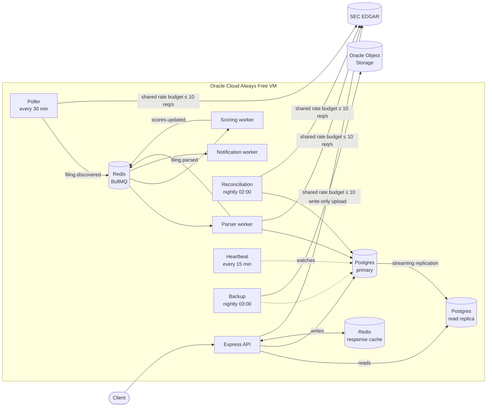

# EDGAR Radar

[](https://github.com/IshanJ9/EDGAR-Radar/actions/workflows/ci.yml)

**A self-running backend that watches SEC filings for 196 large US companies, normalizes their financial data, scores it for warning signs, and detects when a company changes the risks it warns investors about.**

It runs unattended in production, around the clock, at **$0/month**.

> **New to this?** Read the [plain-English explanation](docs/edgar-radar-explained.md). No technical background needed.

**Live API:** [`http://80.225.253.10:3000/companies/0000320193/facts`](http://80.225.253.10:3000/companies/0000320193/facts) (Apple's financial facts). There is no web frontend yet; see [Status](#status).

---

## What it does

| | |
|---|---|
| **Discovers filings** | Every 30 minutes, checks all 196 companies on [SEC EDGAR](https://www.sec.gov/edgar) and queues each new filing **exactly once**. On a normal weekday it finds dozens. |
| **Normalizes financial data** | Pulls XBRL financial facts (revenue, net income, assets, debt…), resolves tag variants, tracks restatements, and **quarantines** values that fail data-quality checks instead of storing them. |
| **Reconciles nightly** | Streams SEC's 1.4 GB bulk `companyfacts.zip` and compares it with every stored value, so nothing missed by the poller stays wrong. |
| **Scores financial health** | Altman Z″ (distress), Piotroski F-Score (strength) and Beneish M-Score (earnings manipulation). Every score carries its inputs, and says "not enough history" rather than guessing. Backtested on Under Armour, Kraft Heinz and GE. |
| **Diffs risk factors** | Compares the "Risk Factors" sections of a company's consecutive 10-Ks using local sentence embeddings, surfacing genuinely **new** and **removed** risks, e.g. Alphabet's Wiz acquisition and Tesla's Robotaxi launch. |
| **Watchlists** | Users register, log in (JWT) and watch companies; a notification worker reports new filings for watched companies. |

---

## Architecture



Everything runs as Docker Compose services on one Oracle Always Free ARM VM (2 OCPU, 12 GB). Every merge to `Main` that passes CI deploys automatically. See [ARCHITECTURE.md](ARCHITECTURE.md) for the scaling narrative (100 → 10,000 → 1,000,000 users) with measured numbers.

---

## Engineering highlights

Each of these was **tested, and verified in production** where that was possible. The full record is in [PROGRESS.md](PROGRESS.md).

- **A provable SEC rate limit.** SEC allows 10 requests/second per host, and four processes call it. Each gets a token-bucket share (burst 1), so the total can't exceed **10 in any one-second window**. A unit test parses the real `docker-compose.yml` and fails CI if the shares ever could.
- **Exactly-once filing discovery.** SEC's `filingDate` has no time of day, and the original poller compared it with a timestamp cursor. That silently skipped **every filing made during the day**: 86 production cycles found 0 filings. It was found by checking the numbers, not by a test. The fix uses a date lookback window plus an accession-number ledger. It has 7 simulated-clock tests and was mutation-checked: all 6 deliberate regressions were caught. Its first two production cycles found **82 filings, each queued once, all 82 processed**.
- **One alert per outage, proven on purpose.** A real 48-hour run once produced **68 alerts for a single outage**. After the fix, a deliberate **2 h 42 min** production outage produced **exactly one** alert, then silence, then a clean recovery.
- **Measured scaling, not claimed.** Load-tested on production with `autocannon`:

  | Configuration (50 connections) | Requests/s | p50 | p99 |
  |---|---|---|---|
  | Primary only | 1,499 | 32 ms | 56 ms |
  | + read replica | 1,486 | 32 ms | 56 ms |
  | + Redis response cache | **4,165** | **11 ms** | **20 ms** |

  The cache gave **2.8×** throughput. The replica gave nothing on a shared host, and the write-up says so and explains why. With the cache on, the bottleneck moved to Node's single thread.
- **Resilient reads.** Reads go to the replica, with a circuit breaker that falls back to the primary in ~4 ms instead of ~3.4 s when the replica is down. Reads that follow a write stay on the primary. Cache invalidation happens at the repository write functions, with a delayed second delete to close the stale-read race.
- **Memory-safe reconciliation.** Streaming the 1.4 GB bulk archive cut peak memory to **481 MB**. The earlier version crashed an 892 MB host.
- **Off-box backups, with a tested restore.** A nightly `pg_dump` is uploaded through a **write-only** pre-authenticated link, so the server can add backups but never read or delete them. A real production backup was restored with **all 17 tables matching row for row**.
- **Free local AI.** Risk-factor embeddings use `all-MiniLM-L6-v2` running in-process through ONNX, with no paid API.
- **Zero cost, permanently.** Oracle Always Free was chosen over trial credits so the deployment doesn't expire.

---

## Tech stack

| Area | Choice |
|---|---|
| Language / runtime | TypeScript, Node.js |
| API | Express 5, Zod validation, JWT + bcrypt auth, pino structured logging |
| Data | PostgreSQL 16 (primary + streaming replica), node-pg-migrate |
| Queue / cache | Redis, BullMQ; a separate LRU Redis for response caching |
| ML | `@huggingface/transformers` (ONNX), `all-MiniLM-L6-v2` sentence embeddings |
| Testing | Jest, Supertest, nock (network blocked in tests), integration tests on throwaway Postgres |
| CI/CD | GitHub Actions (lint, unit tests, build, integration tests) → deploy on merge; protected `Main` |
| Infrastructure | Docker Compose on Oracle Cloud Always Free (ARM); Oracle Object Storage for backups |

---

## API

Base URL: `http://80.225.253.10:3000`. CIKs are SEC company IDs, e.g. `0000320193` for Apple and `0000789019` for Microsoft.

| Method | Path | Description |
|---|---|---|
| `GET` | `/companies` | All 196 monitored companies, each with a summary of its three health scores. |
| `GET` | `/companies/:cik` | Company name. Fetched from SEC on first request, then stored. |
| `GET` | `/companies/:cik/scores` | Altman Z″, Piotroski F and Beneish M with their inputs; "insufficient history" when a score can't be computed fairly. Stored companies only. |
| `GET` | `/companies/:cik/facts` | Normalized financial facts. Served from cache (`X-Cache: HIT/MISS`). |
| `GET` | `/companies/:cik/risk-factor-diff` | New and removed risk factors between the last two 10-Ks. Computed when a 10-K arrives; this only reads (404 until one is stored). |
| `GET` | `/filings/recent` | Filings discovered in the last `hours` (default 24, max 168), newest first, with plain categories. `exclude=offering` folds away routine bond paperwork. |
| `GET` | `/stats` | Live pipeline numbers: companies monitored, last poll, last nightly reconciliation, filings in the last 24 hours. |
| `POST` | `/auth/register` | `{ "email", "password" }` (password ≥ 8 characters) |
| `POST` | `/auth/login` | `{ "email", "password" }` → `{ "token" }` |
| `GET` | `/watchlist` | Your watched companies. Needs `Authorization: Bearer <token>`. |
| `POST` | `/watchlist` | `{ "cik" }`. Adds a company. |
| `DELETE` | `/watchlist/:cik` | Removes a company. |

```bash
curl http://80.225.253.10:3000/companies/0000320193/facts
```

---

## Run it locally

Requires Docker. From a clean checkout:

```bash
cp .env.example .env
docker compose up --build
```

Set `EDGAR_CONTACT_EMAIL` in `.env` to a real address first: SEC requires a contact in every request's `User-Agent`. This starts Postgres (and its replica), both Redis instances, the migrations, the API on port 3000, the three workers, the poller, reconciliation and the heartbeat. A clean checkout with only `.env.example` copied was verified on a fresh GitHub runner on 2026-09-15; the replica, cache and background-job services were added after that check.

The image build downloads the embedding model once, from Hugging Face.

### Tests

```bash
npm install
npm test                  # 262 unit tests; no network, SEC is mocked with nock
npm run test:integration  # 35 tests against a throwaway Postgres in Docker
npm run lint
```

---

## Project structure

```
src/
  routes/           Express routes (companies, auth, watchlist)
  repositories/     All SQL, one module per aggregate
  poller.ts         Filing discovery (exactly-once)
  parserWorker.ts   Ingests discovered filings
  scoring.ts        Altman Z″, Piotroski F, Beneish M
  riskFactorDiff.ts Embedding-based risk-factor diffing
  reconciliation.ts Nightly bulk-data reconciliation (streaming)
  alerting.ts       Heartbeat: one alert per outage
  sec.ts            SEC client: rate budget, retries, User-Agent
  db.ts, cache.ts   Replica routing + circuit breaker; response cache
  __tests__/        Unit and integration tests
scripts/            Entry points: workers, poller, reconciliation, heartbeat, backfill, backtest, load test
migrations/         Database schema (node-pg-migrate)
docker/             Postgres replica setup, backup job
```

---

## Status

| | |
|---|---|
| ✅ Done | Phases 0–7 of the [roadmap](ROADMAP.md): ingestion, normalization, the poller, queue and workers, scoring and risk-factor diffs, CI/CD and deployment, and scaling (replica, cache, load test). Also production ingestion (the poller, reconciliation and heartbeat live) and nightly off-box backups. |
| 🚧 Next | A web frontend for non-technical users (search, plain-English scores, charts) with HTTPS and a domain; deeper history, so more companies can be scored. |
| ⚠️ Known limits | Served over plain HTTP on a bare IP. 63 of 196 companies get all three scores and 33 get none: the scores don't fit banks and insurers (no current assets or liabilities), some companies report no operating income, and a score is shown only when every figure exists for the same year. Every issue found is logged in [PROGRESS.md](PROGRESS.md), including the fixed ones. |

---

## Documentation

- [docs/edgar-radar-explained.md](docs/edgar-radar-explained.md): the project in plain English
- [ARCHITECTURE.md](ARCHITECTURE.md): system design and the measured scaling narrative
- [ROADMAP.md](ROADMAP.md): phase-by-phase plan, each with a "Done when" bar
- [PROGRESS.md](PROGRESS.md): a detailed engineering log of every step, test and incident

---

*EDGAR Radar surfaces public data and well-known financial indicators. It is not investment advice.*
